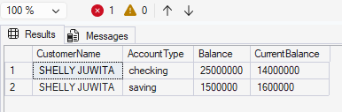
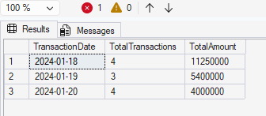

# End-to-End Data Engineering Project: Banking Data Warehouse

## 📌 Overview

Project ini bertujuan untuk membangun **Data Warehouse** dari berbagai sumber data (Excel, CSV, dan SQL Server) menggunakan pendekatan **ETL (Extract, Transform, Load)**.

Project ini dibuat sebagai bagian dari **Project-Based Internship Rakamin x ID/X Partners (Data Engineer Track)**.

---

## 🎯 Objectives

- Mengintegrasikan data dari berbagai sumber
- Melakukan transformasi data sesuai kebutuhan bisnis
- Membangun Data Warehouse (DWH)
- Membuat Stored Procedure untuk analisis data

---

## 🗂️ Data Sources

Data berasal dari beberapa sumber:

- 📄 `transaction_excel.xlsx` (Excel)
- 📄 `transaction_csv.csv` (CSV)
- 🗄️ SQL Server:

  - `transaction_db`
  - `account`
  - `customer`
  - `branch`
  - `city`
  - `state`

---

## ⚙️ Tech Stack

- Python (Pandas, pyodbc)
- SQL Server
- VS Code

---

## 🔄 ETL Process

### 1. Extract

- Mengambil data dari:

  - Excel (`pandas.read_excel`)
  - CSV (`pandas.read_csv`)
  - SQL Server (`pyodbc`)

### 2. Transform

- Join tabel (customer + city + state)
- Standardisasi nama kolom (PascalCase)
- Uppercase data (sesuai requirement)
- Handling duplicate data
- Convert tipe data (datetime)

### 3. Load

- Data dimasukkan ke Data Warehouse (`DWH`)
- Tabel yang dibuat:

  - `DimCustomer`
  - `DimAccount`
  - `DimBranch`
  - `FactTransaction`

---

## 🏗️ Data Warehouse Schema

Tabel yang digunakan:

- **Dimension Tables**

  - DimCustomer
  - DimAccount
  - DimBranch

- **Fact Table**

  - FactTransaction

---

## 🧠 Stored Procedures

### 📊 1. DailyTransaction

Menampilkan jumlah transaksi dan total nominal per hari berdasarkan rentang tanggal.

```sql
EXEC DailyTransaction
    @start_date = '2024-01-18',
    @end_date = '2024-01-20';
```

---

### 💰 2. BalancePerCustomer

Menghitung saldo akhir customer berdasarkan tipe transaksi:

- Deposit → menambah saldo
- Withdrawal/Transfer → mengurangi saldo

```sql
EXEC BalancePerCustomer
    @name = 'SHELLY JUWITA';
```

---

## 📸 Sample Output

### Balance Per Customer



### Daily Transaction



---

## 📁 Project Structure

```
data/
scripts/
sql/
tests/
assets/
README.md
requirements.txt
```

---

## 🚀 How to Run

### 1. Clone repository

```
git clone <your-repo-link>
```

### 2. Install dependencies

```
pip install -r requirements.txt
```

### 3. Setup database

- Restore `sample.bak` di SQL Server
- Jalankan script di folder `sql/`

### 4. Run ETL

```
python scripts/main.py
```

---

## 💡 Key Learnings

- Implementasi ETL pipeline end-to-end
- Data cleaning & transformation
- Data Warehouse design
- SQL Stored Procedure
- Handling real-world data issues (duplicate, data type mismatch)

---

## 👨‍💻 Author

**Gilang Cahya Pinandhita**

---
